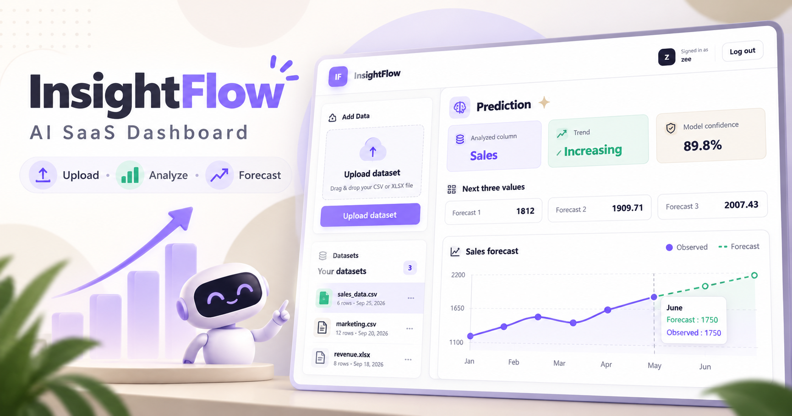

# 🤖 AI-Enabled SaaS Dashboard

A full-stack AI-powered SaaS application built with Django, Next.js, and scikit-learn. Upload your business data and get instant AI predictions, trend analysis, and beautiful visualizations.



---

## 🌟 Features

- 🔐 **JWT Authentication** — Secure signup, login, and token-based access
- 📁 **CSV/Excel Upload** — Upload any business data file
- 📊 **Data Visualization** — Forecast line charts powered by Recharts
- 🤖 **AI Predictions** — Linear Regression model predicts future trends
- 📈 **Trend Analysis** — Detects increasing/decreasing patterns
- 🎯 **Confidence Score** — Shows how accurate the prediction is
- 💡 **AI Insights** — Human-readable explanation of results

---

## 🏗️ System Architecture

AI-Enabled-SaaS-Product/
├── accounts/                  # Authentication app
│   ├── serializers.py         # User serializers
│   ├── views.py               # Register & profile views
│   └── urls.py                # Auth routes
├── backend/                   # Django project config
│   ├── settings.py            # Project settings
│   └── urls.py                # Main URL routing
├── dashboard/                 # Main feature app
│   ├── models.py              # UploadedFile, DataRow, PredictionResult
│   ├── serializers.py         # Dashboard serializers
│   ├── views.py               # Upload, data, prediction views
│   ├── urls.py                # Dashboard routes
│   └── ai_service.py         # AI prediction logic
├── frontend/                  # Next.js application
│   ├── app/                   # Home, auth, and protected dashboard routes
│   ├── components/            # Auth, upload, dataset, and forecast UI
│   └── utils/api.js           # Axios API client and JWT refresh handling
├── manage.py
└── requirements.txt

---

## 🚀 Getting Started

### Prerequisites
- Python 3.14+
- Django 6.0.6
- Node.js 20+

### Backend Setup

```bash
# Clone the repository
git clone https://github.com/muhammadzeeshanlilla/AI-Enabled-SaaS-Product.git
cd AI-Enabled-SaaS-Product

# Create virtual environment
python -m venv venv
source venv/bin/activate  # Windows: venv\Scripts\activate

# Install dependencies
pip install -r requirements.txt

# Run migrations (the repository already contains the migration files)
python manage.py migrate

# Start Django server
python manage.py runserver
```

### Frontend Setup

```bash
# Go to frontend folder
cd frontend

# Install dependencies
npm install

# Optional: configure a different backend URL
# Copy .env.example to .env.local and update NEXT_PUBLIC_API_BASE_URL

# Start Next.js
npm run dev
```

### Access the App

| Service | URL |
|---------|-----|
| Frontend | http://localhost:3000 |
| Backend API | http://127.0.0.1:8000 |
| Admin Panel | http://127.0.0.1:8000/admin |

The frontend reads `NEXT_PUBLIC_API_BASE_URL` from `frontend/.env.local`. If it is not set, it uses
`http://127.0.0.1:8000`.

### Verification

Run backend checks from the project root:

```powershell
python manage.py check
python manage.py test
```

Run the frontend production build:

```powershell
cd frontend
npm run build
```

The frontend includes the complete flow for registration, login, JWT refresh and logout, protected
dashboard access, CSV/XLSX upload, dataset browsing, prediction results, trend and confidence
metrics, three forecast values, an insight, and a Recharts forecast visualization.

---

## 📡 API Endpoints

### Authentication
| Method | Endpoint | Description | Auth Required |
|--------|----------|-------------|---------------|
| POST | `/api/auth/register/` | Create new account | No |
| POST | `/api/auth/login/` | Login and get tokens | No |
| POST | `/api/auth/token/refresh/` | Refresh access token | No |
| GET | `/api/auth/profile/` | Get user profile | Yes |

### Dashboard
| Method | Endpoint | Description | Auth Required |
|--------|----------|-------------|---------------|
| POST | `/api/dashboard/upload/` | Upload CSV/Excel file | Yes |
| GET | `/api/dashboard/files/` | List uploaded files | Yes |
| GET | `/api/dashboard/files/<id>/` | Get file data | Yes |
| POST | `/api/dashboard/files/<id>/predict/` | Run AI prediction | Yes |

---

## 🤖 How the AI Works

1. User uploads a CSV file
2. Django reads the file using **Pandas**
3. The AI service finds the first **numeric column**
4. A **Linear Regression** model is trained on the data
5. The model predicts the **next 3 future values**
6. Returns trend direction, confidence score, and forecast

```python
# Example AI output
{
  "column_analyzed": "Sales",
  "trend": "increasing",
  "forecast_next_3": [1812.0, 1909.71, 2007.43],
  "confidence": 89.8,
  "insight": "Sales is increasing. Next 3 predicted values: [1812.0, 1909.71, 2007.43]"
}
```

---

## 🗄️ Database Models

### UploadedFile
| Field | Type | Description |
|-------|------|-------------|
| user | ForeignKey | Owner of the file |
| file_name | CharField | Original filename |
| row_count | IntegerField | Number of rows |
| columns | JSONField | Column names |
| uploaded_at | DateTimeField | Upload timestamp |

### DataRow
| Field | Type | Description |
|-------|------|-------------|
| uploaded_file | ForeignKey | Parent file |
| row_data | JSONField | Row as key-value pairs |
| row_index | IntegerField | Row position |

### PredictionResult
| Field | Type | Description |
|-------|------|-------------|
| user | ForeignKey | Who ran the prediction |
| uploaded_file | ForeignKey | Source file |
| result | JSONField | AI output |
| created_at | DateTimeField | When predicted |

---

## 📊 Sample Data Format

```csv
Month,Sales,Revenue
January,1200,45000
February,1350,52000
March,1500,58000
April,1420,54000
May,1600,61000
June,1750,67000
```

---

## 🔒 Security Features

- JWT token authentication on all protected routes
- Passwords hashed using Django's built-in system
- CORS configured to allow only localhost:3000
- User data isolated — users only see their own files

---

## 👨‍💻 Developer

**Muhammad Zeeshan**
- GitHub: [@muhammadzeeshanlilla](https://github.com/muhammadzeeshanlilla)
- Project: AI-Enabled SaaS Product — Internship Capstone Project

---

## 📄 License

This project was built as part of an internship program final capstone project.
